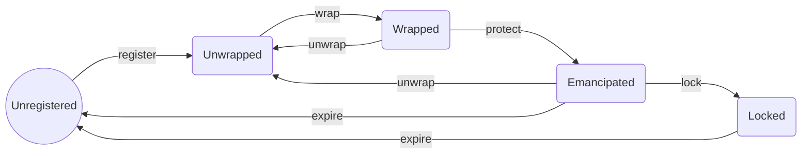

# Wrapped States

Taking the Name Wrapper into account, an ENS name can be in one of these possible states:

### Unregistered

The name has not even been registered/created yet, or it has expired.

### Unwrapped

The name exists and has not expired (in the case of .eth second-level names). The Name Wrapper contract does not have ownership over the name. You own the name in the registry and/or .eth registrar.

### Wrapped

The Name Wrapper contract has ownership of the name (in the registry/registrar). You are issued an ERC-1155 NFT in return, which proves that you are the actual owner.

You can unwrap the name at any time, which burns the ERC-1155 NFT, and returns ownership in the registry/registrar back to you.

If your name is a subname like `sub.name.eth`, then the owner of `name.eth` can technically replace the subname and transfer it to a different owner.

In addition, the parent owner can burn parent-controlled fuses on your name.

### Emancipated

The owner of the parent name is no longer able to replace this name, or burn any additional fuses on it. All .eth second-level names (like `name.eth`) are automatically put into the Emancipated state when they are wrapped.

The name can still be unwrapped and rewrapped by the owner.

### Locked

The name can no longer be unwrapped. The owner can now burn owner-controlled fuses on the name. Fuses for subnames of this name can now be burned as well.

---

# Estados Envueltos

Tomando en cuenta el Name Wrapper, un nombre ENS puede estar en uno de estos estados posibles:

### No Registrado

El nombre ni siquiera ha sido registrado/creado aún, o ha expirado.

### No Envuelto

El nombre existe y no ha expirado (en el caso de nombres de segundo nivel .eth). El contrato Name Wrapper no tiene propiedad sobre el nombre. Posees el nombre en el registro y/o registrador .eth.

### Envuelto

El contrato Name Wrapper tiene propiedad del nombre (en el registro/registrador). Se te emite un NFT ERC-1155 a cambio, que prueba que eres el propietario real.

Puedes desenrollar el nombre en cualquier momento, lo que quema el NFT ERC-1155, y devuelve la propiedad en el registro/registrador de vuelta a ti.

Si tu nombre es un subnombre como `sub.name.eth`, entonces el propietario de `name.eth` puede técnicamente reemplazar el subnombre y transferirlo a un propietario diferente.

Además, el propietario padre puede quemar fusibles controlados por el padre en tu nombre.

### Emancipado

El propietario del nombre padre ya no puede reemplazar este nombre, o quemar cualquier fusible adicional en él. Todos los nombres de segundo nivel .eth (como `name.eth`) se ponen automáticamente en el estado Emancipado cuando están envueltos.

El nombre aún puede ser desenrollado y reenvuelto por el propietario.

### Bloqueado

El nombre ya no puede ser desenrollado. El propietario ahora puede quemar fusibles controlados por el propietario en el nombre. Los fusibles para subnombres de este nombre ahora también pueden ser quemados.
